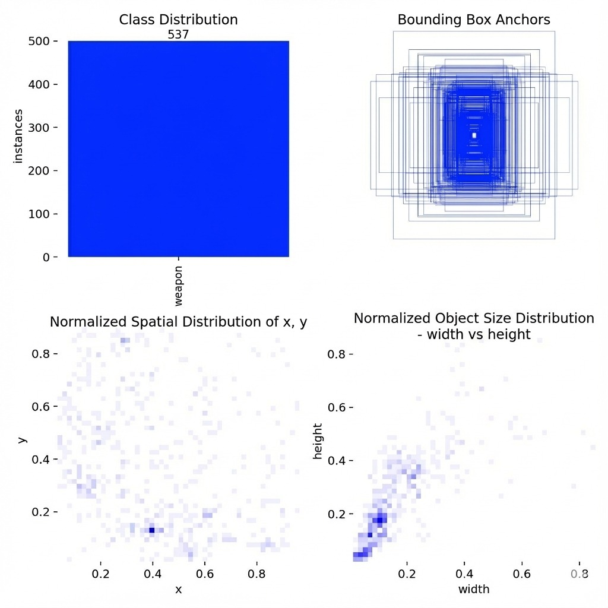
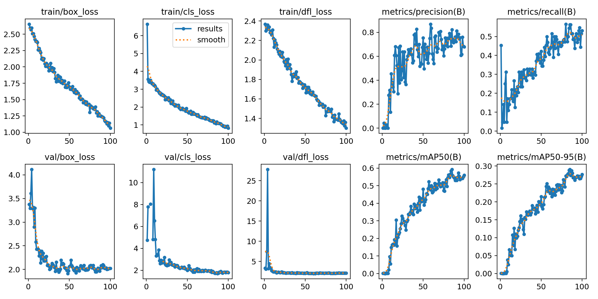
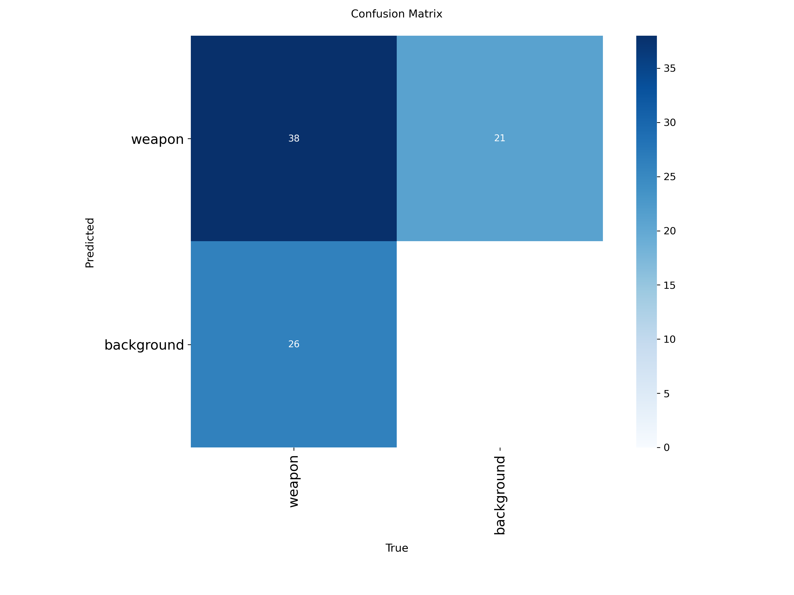
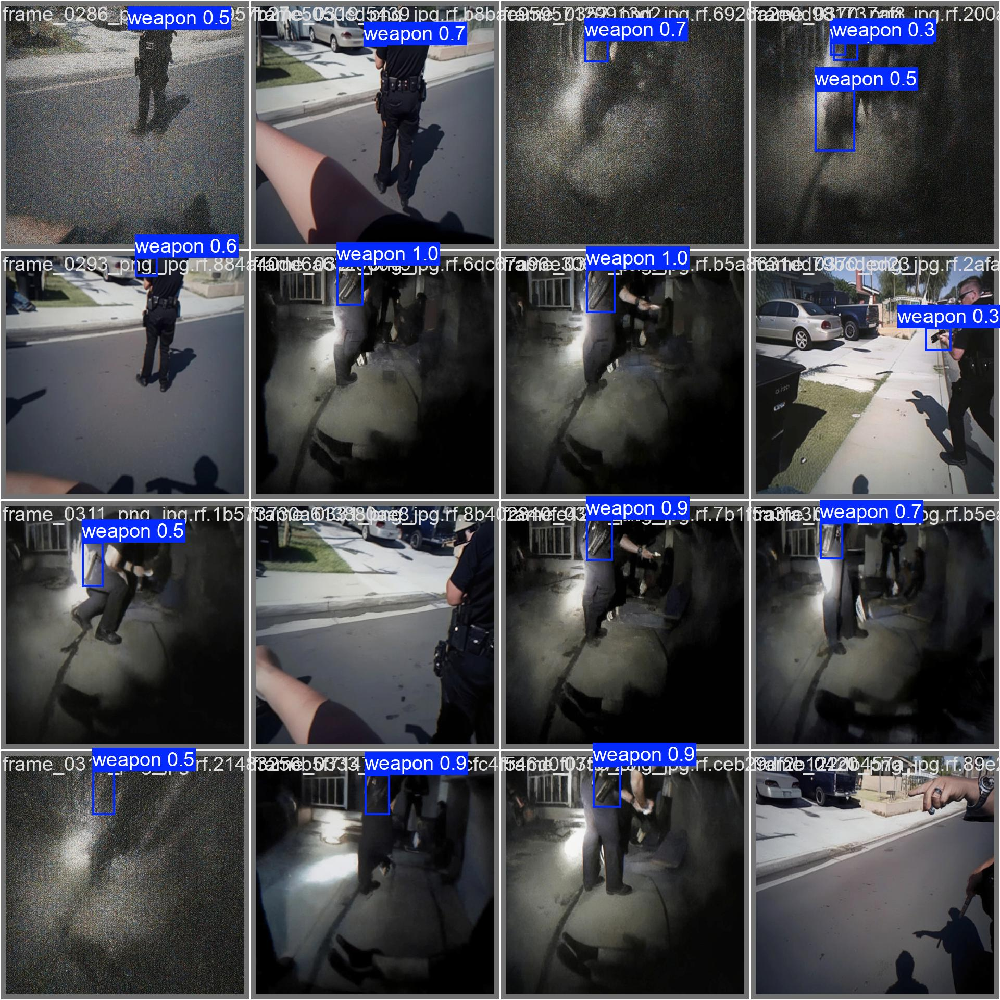

# Weapon Detection from Body-Cam using GenAI & YOLOv8

**Authors:** Hen Golyan, Aviv Heller, Afik Suissa  
**Course:** Generative AI and Computer Vision (Semester A)

## 📌 Overview
This project focuses on detecting weapons in footage from body-worn cameras (body-cams), aiming to improve situational awareness and safety for military and public safety applications. 

Detecting weapons in body-cam footage presents unique challenges compared to standard CCTV:
* Strong motion blur and rapid movement.
* Extreme viewpoint changes and occlusions.
* Dynamic lighting conditions.

To address the lack of labeled body-cam data, we employed a **Hybrid Training Strategy**, combining real-world surveillance images with **Synthetic Data** generated using Generative AI (Diffusion-based inpainting) to simulate diverse scenarios.

## 🚀 Features
* **Model:** YOLOv8s (Small) optimized for real-time detection.
* **Data Augmentation:** Custom synthetic dataset generation to expand training variety.
* **Performance:** ~5.4ms inference speed on T4 GPU.

## 📂 Dataset
Our dataset is a hybrid mix of real-world images and synthetically generated samples:
1.  **Real Data (Current):** 500 real-world images augmented with **Motion Blur** and **Fisheye** effects to simulate body-cam characteristics.
2.  **Synthetic Data (Planned):** Future expansion will include images where weapons are synthetically added (inpainting) to scenes that originally contained no weapons.

### Download the Data
You can access our processed datasets and YOLO-formatted labels directly from Google Drive:

| Resource | Link |
|----------|------|
| **Synthetic Dataset (Images)** | [Download from Drive](https://drive.google.com/drive/folders/11ynrEJjgT5IehCu0YtkeYvEf9Efu2EL5?usp=sharing) |
| **YOLO Labels & Configs** | [Download from Drive](https://drive.google.com/drive/folders/1vCNx0u0CHb-hZ8BBQpcHV255kmdzuivy?usp=sharing) |

> **Note:** Please ensure you update the `data.yaml` paths in the notebook to point to your local directory structure after downloading.

## 🛠️ Installation & Usage

### Prerequisites
* Python 3.8+
* PyTorch
* Ultralytics (YOLOv8)

### Setup
1. Clone the repository:
   ```bash
   git clone [https://github.com/hengolyan/Weapons-detection-from-body-cam-GenAI.git](https://github.com/hengolyan/Weapons-detection-from-body-cam-GenAI.git)
   cd Weapons-detection-from-body-cam-GenAI
   ```

2. Install dependencies:
   ```bash
   pip install ultralytics torch torchvision opencv-python matplotlib
   ```

3. **Training & Inference:**
   Open the Jupyter Notebook `bodycam_weapon_detection.ipynb` to run the training pipeline, including data preparation, model training, and evaluation.

## 📊 Results (Baseline)
Initial evaluation on the validation set using YOLOv8s:

* **mAP@0.5:** 0.532 (53.2%)
* **Precision:** 0.692 (69.2%)
* **Recall:** 0.508 (50.8%)
* **Inference Speed:** 5.4ms/img (T4 GPU)

*(Further improvements expected with Phase 3 Hybrid Training)*.

## 📈 Visualizations

### Dataset Analysis


### Training Performance


### Model Evaluation


### Detection Example


## 📜 License
This project is for educational and research purposes.
